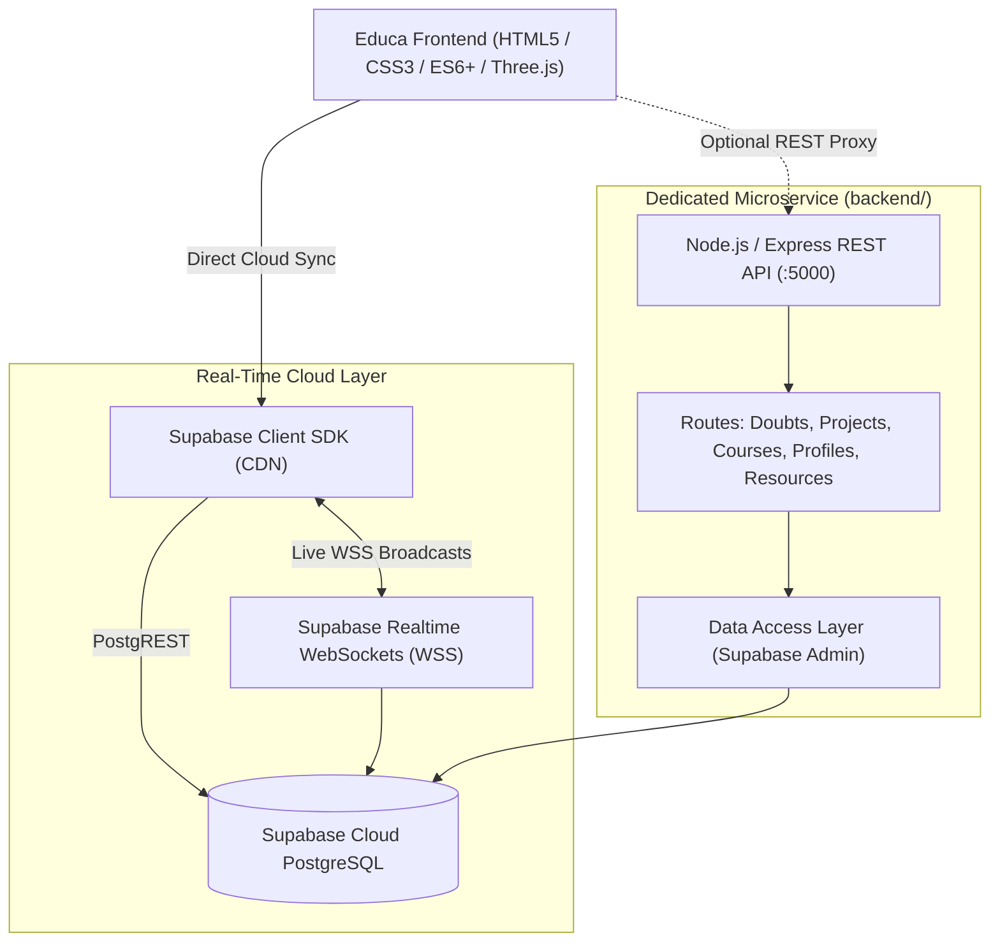

# 🎓 Educa — Next-Gen Smart Education & Collaborative Learning Portal

> **Future of Education Challenge**: Reimagining how students learn, practice, collaborate, and access academic resources through modern web technologies, real-time peer interactions, and immersive 3D simulations.

[](https://supabase.com)
[](https://threejs.org)
[](https://expressjs.com)
[](LICENSE)

---

## 🌟 Vision & Platform Highlights

**Educa** is an all-in-one educational ecosystem engineered to overcome traditional e-learning limitations (passive video watching, isolation, and lack of practical peer feedback). It introduces an interactive, community-driven approach equipped with real-time cloud capabilities:

1. **🗺️ Adaptive Skill Roadmaps & Spaced Repetition**:
   - Structured career pathways (Full-Stack Web Architect, AI & Machine Learning, Data Structures & Systems).
   - Dynamic progress tracking, XP milestones, and retention-optimized spaced recall decks.

2. **💡 Peer Doubt-Solving Nexus (Real-Time WebSockets)**:
   - Live Q&A forum with bounty XP incentives for verified community explanations.
   - Code snippet preview, solution upvoting, and instructor acceptance badges.
   - Instant WebSocket broadcasting powered by **Supabase Realtime**.

3. **🚀 Project Collaboration & Team Pitch Vault**:
   - Platform for students to pitch capstone ideas, declare open team roles, and recruit peers.
   - Instant team applications and real-time team capacity updates.

4. **🔬 3D Interactive Tech Laboratories**:
   - Immersive WebGL simulations built with **Three.js** simulating server architectures, memory caches, and compiler pipelines.
   - Interactive orbit controls, node raycasting diagnostics, and live system latency telemetry.

5. **📚 Academic Resource Vault**:
   - Community-curated cheat sheets, exam survival guides, starter boilerplates, and lecture notes.
   - Upvoting, verified student uploads, and download analytics.

6. **🌐 Vernacular Multilingual Localization**:
   - Real-time client-side language switching between **English (en)**, **Hindi (hi)**, **Spanish (es)**, and **Tamil (ta)**.

7. **🎮 Gamification & Analytics Dashboard**:
   - XP progression, mastery levels, daily login streaks, achievement badges, and Radar Skill Chart visualizations using **Chart.js**.

---

## 🏗️ Technical Architecture



---

## 📁 Repository Structure

```
├── frontend/                     # Modern Single-Page & Standalone Web App
│   ├── 3D_lab.html               # Dedicated 3D Interactive WebGL Lab page
│   ├── about_us.html             # Platform mission, stats & testimonials
│   ├── collab.html               # Project Collab Vault & Resource Hub
│   ├── contact.html              # Direct messaging & inquiry form
│   ├── courses.html              # Course catalog with live search & filters
│   ├── doubts.html               # Peer Doubt-Solving Nexus with bounty system
│   ├── roadmap.html              # Career pathways & spaced repetition planner
│   ├── teacher.html              # Expert instructor roster & tutor profiles
│   ├── tutor_area.html           # Tutor analytics and video upload portal
│   ├── index.html                # Unified SPA portal with responsive hero
│   ├── script.js                 # Frontend state engine, routing & Three.js
│   ├── style.css                 # Glassmorphism design tokens & typography
│   ├── supabase-client.js        # Supabase Realtime client service layer
│   ├── css/                      # Modular style sheets for all subpages
│   └── images/                   # Avatars, course thumbnails, and media assets
│
├── backend/                      # Production-Grade Express.js REST API
│   ├── config/
│   │   └── supabase.js           # Supabase connection client & health check
│   ├── middleware/
│   │   ├── auth.js               # User authorization & student persona resolver
│   │   └── errorHandler.js       # Centralized error handler & 404 router
│   ├── models/                   # Data access models for PostgreSQL tables
│   │   ├── Course.js, Doubt.js, Project.js, Profile.js, Resource.js, Contact.js
│   ├── routes/                   # RESTful API endpoints
│   │   ├── courseRoutes.js, doubtRoutes.js, projectRoutes.js, etc.
│   ├── .env                      # Configured Supabase credentials
│   ├── .env.example              # Configuration template
│   ├── package.json              # Server dependencies & npm scripts
│   ├── server.js                 # Express server entry point & middleware
│   └── README.md                 # Backend API documentation & cURL specs
│
├── ppt.pdf                       # Comprehensive 8-Page Executive Presentation Deck
├── course_db.sql                 # Reference relational database schema
└── README.md                     # Root project documentation
```

---

## 🚀 Quick Start Guide

### Option 1: Frontend Direct Mode (Zero Dependencies)
The frontend connects directly to the Supabase Cloud backend via CDN and does not require Node.js or local servers:
1. Navigate to the `frontend/` folder.
2. Open [`frontend/index.html`](frontend/index.html) in any modern browser (or use VS Code Live Server).
3. Experience live course browsing, roadmap tracking, real-time doubt posting, and 3D laboratory simulations immediately.

### Option 2: Dedicated Express Backend Mode
If you have Node.js installed and wish to run the local API service:
```bash
# 1. Navigate to backend directory
cd backend

# 2. Install dependencies
npm install

# 3. Start development server
npm run dev
# Server will start on http://localhost:5000 with API endpoints at /api
```

---

## ⚡ Supabase Cloud Database & Real-Time Setup

The platform is integrated with Supabase project **`Education`** (`jybnhvlsccruhkdsvvtq`):

### Database Schema (10 PostgreSQL Tables)
- **`profiles`**: User details, total XP points, skill level, daily streak, and earned badges.
- **`courses`**: Video playlists, tutor IDs, course descriptions, and categories.
- **`roadmaps` & `user_milestones`**: Learning tracks and milestone completion timestamps.
- **`doubts`** *(Realtime)*: Questions, tags, XP bounties, vote counts, and resolution flags.
- **`doubt_answers`** *(Realtime)*: Peer explanations, code solutions, and accepted status.
- **`collab_projects`** *(Realtime)*: Project pitches, required tech stack, and member capacity.
- **`project_applications`** *(Realtime)*: Applications to join collaborative teams.
- **`resources`**: Academic downloads, cheat sheets, and resource ratings.
- **`contact_messages`**: Contact form submissions.

---

## 📊 REST API Summary (`backend/`)

| Method | Endpoint | Description |
| :--- | :--- | :--- |
| `GET` | `/health` | Server and Supabase database connection health check |
| `GET` | `/api/doubts` | Fetch all questions with answers, tags, and vote counts |
| `POST` | `/api/doubts` | Post a new doubt with an XP bounty |
| `POST` | `/api/doubts/:id/vote` | Upvote a question |
| `POST` | `/api/doubts/:id/answers` | Submit an answer to a doubt |
| `PATCH` | `/api/doubts/:id/answers/:ansId/accept` | Mark an answer as accepted solution |
| `GET` | `/api/projects` | List all collaboration project pitches |
| `POST` | `/api/projects` | Pitch a new capstone project |
| `POST` | `/api/projects/:id/apply` | Apply to join a project team |
| `GET` | `/api/courses` | Query courses by category or keyword |
| `GET` | `/api/profiles/:id` | Get student progress, XP level, and achievements |
| `POST` | `/api/resources` | Share verified academic resources |

---

## 🏆 Future of Education Challenge Alignment

| Direction | How Educa Solves It |
| :--- | :--- |
| **Personalized Study Planner** | Adaptive roadmaps with milestone XP, dynamic time-tracker, and spaced repetition recall checkpoints. |
| **Peer-Learning Platform** | Real-time Doubt Nexus where learners answer questions to earn bounty XP and contributor badges. |
| **Doubt-Solving Portal** | Instant WebSocket feedback, code formatting, instructor solutions, and AI Co-Pilot hints. |
| **Interactive Dashboard** | Radar chart mastery metrics, daily streak counter, and dynamic category filters. |
| **Resource-Sharing Platform** | Academic Vault for cheat sheets, starter kits, and notes with ratings and download tracking. |
| **Project Collaboration Portal** | Pitching capstone ideas, publishing open roles, and recruiting peers with live member counters. |
| **Immersive Experience** | Three.js WebGL 3D laboratories allowing students to interactively explore server nodes and compiler internals. |

---

## 📄 License & Credits
Built for the **Future of Education Challenge 2026**. Licensed under the [MIT License](LICENSE).
